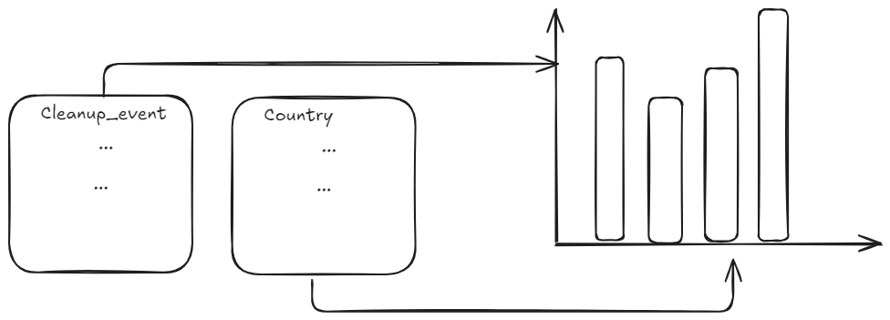
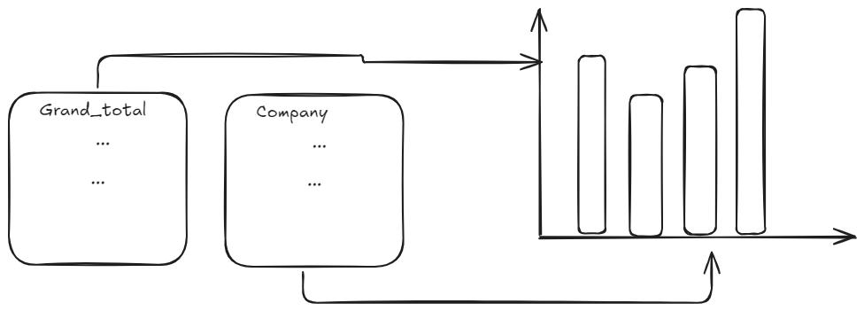

## Context of the dataset

The data is an audit of plastic pollution done by Break Free From Plastic's Brand Audit on the city of St. Johns in Newfoundland, Canada. The variables recorded include locations of cleanups and the amount of trash collected for various types of trash.

## Cleaning

This snippet has been provided as a cleaning script by the people who published the dataset.

```{r}
library(tidyverse)
library(fs)

files_2020 <- fs::dir_ls("2020 BFFP National Data Results") %>% 
  str_subset("csv")

files_2019 <- fs::dir_ls("2019 Brand Audit Appendix _ Results by Country/Countries") %>% 
  str_subset("csv")

data_2020 <- files_2020 %>% 
  map_dfr(read_csv, col_types = cols(
    Country = col_character(),
    Parent_company = col_character(),
    Empty = col_double(),
    HDPE = col_double(),
    LDPE = col_double(),
    O = col_double(),
    PET = col_double(),
    PP = col_double(),
    PS = col_double(),
    PVC = col_double(),
    Grand_Total = col_character(),
    num_events = col_double(),
    volunteers = col_double()
  )) %>% 
  mutate(year = 2020, .after = Country) %>% 
  mutate(Grand_Total = parse_number(Grand_Total)) %>% 
  janitor::clean_names()

data_2019 <- files_2019 %>% 
  set_names(str_replace(., ".*[/]([^.]+)[.].*", "\\1")) %>% 
  map_dfr(read_csv, .id = "country", col_types = cols(
    Country = col_character(),
    Parent_company = col_character(),
    Empty = col_double(),
    HDPE = col_double(),
    LDPE = col_double(),
    O = col_double(),
    PET = col_double(),
    PP = col_double(),
    PS = col_double(),
    PVC = col_double(),
    Grand_Total = col_double(),
    num_events = col_double(),
    volunteers = col_double()
  )) %>% 
  select(country, everything()) %>% 
  mutate(year = 2019, .after = country) %>% 
  janitor::clean_names()  %>% 
  mutate(pp = if_else(is.na(pp_2), pp, pp_2 + pp),
         ps = if_else(is.na(ps_2), ps, ps + ps_2)) %>% 
  rename(parent_company = parent_co_final, num_events = number_of_events, volunteers= number_of_volunteers) %>% 
  select(-ps_2, -pp_2)

combo_data <- bind_rows(data_2019, data_2020) 

combo_data %>% 
  write_csv("2021/2021-01-26/plastics.csv")
```

This cleaning grabs CSV files in two directories, and converts specific columns to be numeric. Adds a grand total and year column, as well as using the `clean_names` function to enforce naming conventions on variables.

Finally, it merges the datasets and exports the combined data into a csv file.

## Research questions with current data

- Are there more cleanup events in certain-areas than others?
- How does plastic polllution vary across companies?

## Research questions with supplemental data

- How does volunteer participation vary across the time of day during a pickup event?
- Do companies with climate action programs pollute less?

## Visualizations






